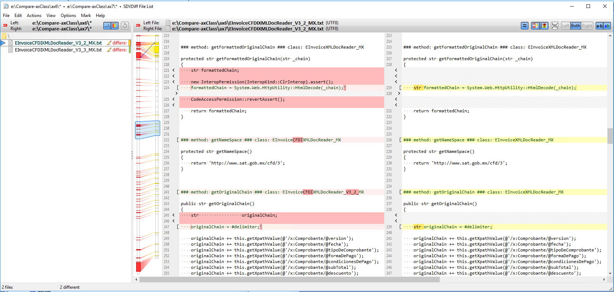
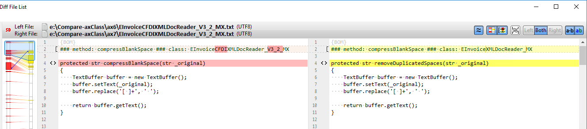
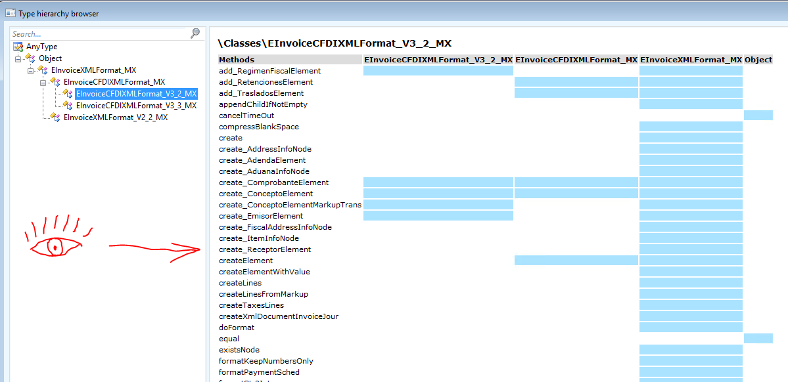

mazzy@mazzy.ru, 2017-10-12, [https://github.com/mazzy-ax/compare-axClass](https://github.com/mazzy-ax/compare-axClass)


 

---

# Compare-axClass: инструмент для сравнения кода методов классов ax6 и ax7

При подъеме кода из Dynamics AX 2012 (Axapta 6) в Dynamics 365 For Operation (Axapta 7), программисты зачастую выполняют рефакторинг классов и методов - изменяют иерархию классов, переименовывывают методы, добавляют параметры, изменяют код и так далее.

Возникает задача - **сравнить код методов и классов** в разных версиях Аксапты.

Для сравнения кода в текстовых файлах существует масса стандартных инструментов, которые позволяют сравнить как отдельные файлы, так и групу файлов в соседних каталогах. Например, fc, windiff, git diff, sd diff, sdvdiff и прочие. Поэтому в данном проекте не ставится задача создания инструмента сравнения - будем использовать стандартные.

Задача данного проекта - подготовить текстовые файлы с кодом, которые будет удобно сравнивать. Код в этих текстовых файлах запишем так, чтобы сравнивалкам было удобно сравнивать, а человеку было удобно считывать и понимать какой код, какой метод и в каком классе отличается и требует доработки.



## Состав сравниваемых файлов

В разных версиях аксапты код хранится в разном формате. Кроме того, из-за объединения или разделения классов, из-за переноса некоторых методов в другие классы недостаточно сравнить один класс из одной версии с таким же классом из другой версии. Как правило, нужно сравнивать целые ветки семейства - от корневого до крайнего потомка, который расположен на границе.

Поэтому в каждый текстовый файл выводим всем методы, которые видны граничным потомком. Перед каждым методом отдельной строкой выводим название метода и название класса для сравнения. Чтобы программе сравнения было легче находить изменения, всем методы сортируем по названиям.

Чтобы было удобнее сравнивать методы с измененными названиями предусматриваем возможность "переименовать" метод для сортировки.

Кроме того, бывают косметические изменения, которые не влияют на сам код, но вносят знаительный шум в программе сравнения. Как правило, это изменения в XMLdoc комментариях и дополнительный indent в ax7. Чтобы снизить число ложных срабатываний, предусматриваем удаление XMLdoc комментариев и одного indent'а (4 пробела или одна табуляция)

В каталогах [ax6](ax6) и [ax7](ax7) приведены примеры с сравниваемыми файлами. Сравнение, которое приведено выше, получено командой:

```cmd
> sdvdiff ax6 ax7
```

## Файл с настройками

Настройки приведены в файле [compare-axClass.xml](compare-axClass.xml)

Каждый тег &lt;file&gt; определяет один файл, который будет создан в каталогах. В каждый файл может выводиться методы из нескольких классов. Состав классов может быть разным для ax6 и ax7. Если теги &lt;class&gt; отсутствуют, то берется класс из имени файла. Предполагается, что текстовые файлы получают одинаковое название как для ax6, так и для ax7. Одинаковые названия позволяют продвинутым утилитам автоматически сопоставить сраниваемые файлы.

В секции ax7 можно определить замены для методов. Замены позволяют "разместить" рядом методы переименованные методы.



параметры
* outputDirectory
* removeXmlComments
* removeIndent
* showOverriddenMethods

можно разместить внутри тега &lt;file&gt; - тогда параметр влияет на один файл. А можно разместить внутри группового тега &lt;files&gt; - тогда параметр влияет на все файлы. Параметры также можно разместить внутри тегов &lt;ax6&gt; и &lt;ax7&gt; - тогда они влияют только на соответствующую версию. Чем глубже в xml находится параметр, тем больший приоритет он имеет.

### Параметр showOverriddenMethods

По умолчанию параметр выключен. Это значит, что показывается код всех методов граничного класса и код всех неперекрытых методов, которые "видны" программисту со стороны граничного класса.

Сейчас алгоритм не анализирует наследование классов, а просто работает в порядке, который задан в параметрах - сначала показываются код всех методов первого класса, потом код неотображенных методов второго класса и т.д.



Если включить этот параметр, то будут отображаться код всех методов всех перечисленных в параметрах классов. Чтобы не было путаницы, перед методом выводится и имя метода, и название класса, которому этот метод принадлежит. См. скриншоты выше.

# Как выполнить сравнение

## 1. Параметры

Скачайте или создайте [xml с параметрами](compare-axClass.xml), добавьте необходимые классы в список.

## 2. AX 2012

* Скачайте и импортируйте в ax6 проект [compare_ax6class.xpo](compare_ax6class.xpo). Проект содержит всего один job.
* Измените константы в job.
* Выполните job.

Вы получите текстовые файлы, предназначенные для сравнения.

## 3. AX7

* Скачайте Powershell скрипт [compare-ax7class.ps1](compare-ax7class.ps1).
* Если ваша ax7 работает в Azure, скорее всего, у вас нет прав запускать что-то "дополнительное" в том окружении, где работает аксапта. Поэтому любым удобным способом скачайте xml-файлы с кодом классов к себе на локальную машину. Например, создайте проект с нужными классами в Visual Studio, экспортируйте его в axpp, распакуйте его как zip на локальной машине.
* Выполните Powershell скрипт.

Вы получите текстовые файлы, предназначенные для сравнения.

## 4. Сравнение стандартными утилитами

Выполните сравнение файлов при помощи вашей любимой утилиты сравнения.


# Известные проблемы

* параметр showOverriddenMethods обрабатывается только в ax6. вывод методов ax7 пока игнорирует этот параметр